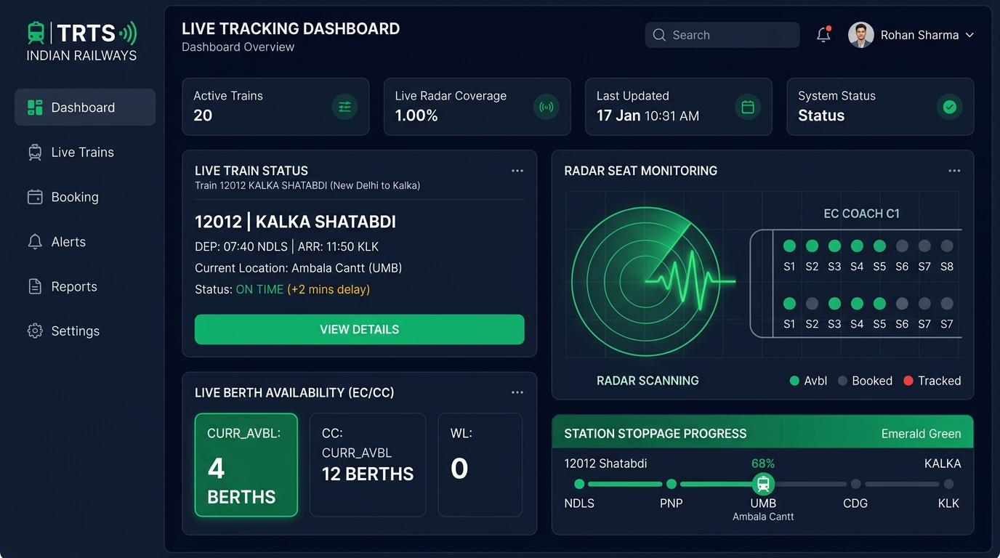
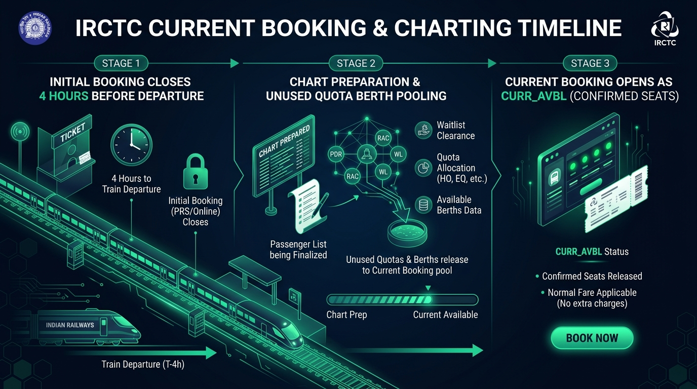
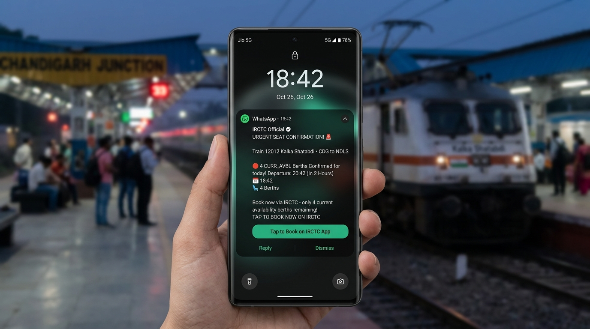

# SeatScout — Indian Railways Current Booking (`CURR_AVBL`) Radar

<p align="center">
  
</p>

<p align="center">
  <strong>Smart 24/7 PRS Berth Radar & Last-Minute Confirmed Seat Alert System for Indian Railways</strong>
</p>

<p align="center">
  <a href="#-interactive-visual-guide"></a>
  <a href="#-meta-whatsapp-cloud-api-integration"></a>
  <a href="#-tech-stack"></a>
  <a href="#-tech-stack"></a>
  <a href="LICENSE"></a>
</p>

---

## 📖 Table of Contents
1. [Why SeatScout? (The Secret of Current Booking)](#-why-seatscout)
2. [Interactive Visual Guide](#-interactive-visual-guide)
3. [Key Features](#-key-features)
4. [Meta WhatsApp Cloud API Integration](#-meta-whatsapp-cloud-api-integration)
5. [Architecture & How It Works](#-architecture--how-it-works)
6. [Tech Stack](#-tech-stack)
7. [Getting Started (Local Setup)](#-getting-started-local-setup)
8. [Configuration (.env Guide)](#-configuration-env-guide)
9. [Production Deployment](#-production-deployment)
10. [API Reference](#-api-reference)

---

## 🎯 Why SeatScout?

Every day, millions of train travelers in India face **Regret**, **Waitlist (WL)**, or **RAC** tickets. Many try Tatkal at 10:00 AM / 11:00 AM, only to face server queues, payment timeouts, and non-refundable ticket fees.

**There is a better, official way:** **Current Booking (`CURR_AVBL`)**.

- **4 Hours Before Train Departure**: Indian Railways PRS locks waitlists and prepares the 1st reservation chart.
- **Pooled Berths**: Unbooked berths from VIP, Senior Citizen, Defence, Foreign Tourist, and Emergency quotas are released into one public pool.
- **Normal Base Fare**: These seats are sold at **standard base fare** (or even with a 10% discount) with **100% confirmed coaches and berth assignments**!
- **The Challenge**: These seats disappear within seconds. Travelers cannot manually refresh IRCTC every 30 seconds.

**SeatScout solves this by running an automated background radar**, watching PRS seat pools continuously and dispatching instant alerts the moment seats unlock.

---

## 🖼️ Interactive Visual Guide

### 1. The 4-Hour Charting & Seat Release Timeline
<p align="center">
  
</p>

| Stage | Timing | What Indian Railways Does | SeatScout Action |
|---|---|---|---|
| **Stage 1: Pre-Charting** | Up to 4 hrs before departure | Waitlist & Tatkal bookings active | Background radar registers train watch |
| **Stage 2: Chart Preparation** | Exactly 4 hrs before departure (or 8 PM previous night for morning trains) | PRS locks waitlists; unbooked quotas (VIP/Defence/Senior) pooled | Radar increases polling frequency |
| **Stage 3: Current Booking Open** | From chart prep until 30 min before departure | Berths release as `CURR_AVBL` with confirmed seat allocation | Instant audio chime, WhatsApp message, SMS & Web Push! |

---

### 2. Multi-Channel Instant Mobile Alerts
<p align="center">
  
</p>

SeatScout provides verified phone alert dispatching through:
- 💬 **Meta WhatsApp Cloud API**: Direct WhatsApp message with zero promotional text, detailing train number, travel class, and available berths.
- 📲 **SMS Mobile Gateway**: Direct SMS to verified 10-digit Indian mobile numbers (Fast2SMS / Twilio).
- 🔔 **Browser Web Push**: W3C standard VAPID notifications on desktop and Android browsers.
- 📧 **Rich HTML Email**: Detailed berth dossiers with station schedules and coach configurations.

---

## ✨ Key Features

- 🛰️ **Automated Seat Radar**: Configurable background polling daemon that monitors PRS berth pools for specific trains, dates, travel classes, and quotas.
- ⚡ **Current Booking (`CURR_AVBL`) Specialist**: Catches post-charting vacant berths released 4 hours before departure (or the night before for morning trains).
- 💬 **Official Meta WhatsApp Cloud API**: Supports direct verification OTP dispatch and real-time seat alerts via WhatsApp.
- 📱 **Multi-Channel Notification Gateway**: Web Push, WhatsApp, SMS, and Email delivery.
- 🤖 **Gemini AI Charting & Strategy Advisor**: Predicts exact charting windows, confirmation chances for waitlisted tickets, and recommends Tatkal vs Current Booking strategies.
- 🛡️ **Resilient PRS Gateway with Circuit Breaker**: Connects to live Indian Railways PRS feeds with 3.5s timeout protection and automatic failover.
- 🚉 **National Station Index (9,000+ Stations)**: High-performance searchable dataset covering all IRCTC station codes, junction aliases, and railway zones.
- 🕒 **Live IRCTC Timetables & Corridor Routing**: Direct PRS train timetable synchronization with real stoppage schedules.
- 🚄 **Live Train Running Status**: Real-time GPS delay tracking, current station, platform numbers, and scheduled vs actual timings.
- 🎯 **One-Click IRCTC Deep Linking**: Direct button to launch the official IRCTC portal pre-filled with train number, journey date, and route.
- 📱 **Progressive Web App (PWA)**: Installable on Android, iOS, and desktop browsers with offline support.

---

## 💬 Meta WhatsApp Cloud API Integration

SeatScout supports official **Meta WhatsApp Cloud API** messaging:

1. **Clean Messaging**: Adheres strictly to non-promotional, neutral notification templates:
   ```text
   Your verification code is: *482019*. Valid for 5 minutes. Do not share this code with anyone.
   ```
2. **Instant Delivery**: Sent directly through Meta's high-speed global Graph API (`https://graph.facebook.com/v20.0/...`).
3. **Graceful Error Recovery**: If an invalid token or `OAuthException` is returned, SeatScout provides:
   - Clear diagnostic feedback in the modal.
   - An on-screen 6-digit code with a 1-click **"Auto-fill Code"** button.
   - A direct **WhatsApp Click-to-Chat link** (`https://wa.me/91...`) so you can open the message directly in WhatsApp.

---

## 🛠️ Tech Stack

- **Frontend**: React 19, Tailwind CSS v4, Lucide React, Motion (`motion/react`), Canvas Confetti
- **Backend**: Node.js, Express, `tsx` TypeScript runner, `esbuild` for production bundling
- **AI Intelligence**: Google Gemini API (`@google/genai`) for charting analysis and booking intelligence
- **Messaging & Notifications**:
  - Meta WhatsApp Business Cloud API (`POST /v20.0/{PHONE_NUMBER_ID}/messages`)
  - `web-push` (W3C Web Push Protocol with VAPID keys)
  - `nodemailer` (SMTP transport for email dossiers)
  - Fast2SMS & Twilio REST APIs (SMS delivery)
- **Data Source**: Live Indian Railways PRS & CRIS integration with smart gateway circuit breakers

---

## ⚡ Getting Started (Local Setup)

### 1. Clone the Repository
```bash
git clone https://github.com/Nitish-24/SeatScout.git
cd SeatScout
```

### 2. Install Dependencies
```bash
npm install
```

### 3. Configure Environment Variables
Copy `.env.example` to `.env`:
```bash
cp .env.example .env
```

Edit `.env` and fill in your keys (see guide below).

### 4. Run Development Server
```bash
npm run dev
```

Open **`http://localhost:3000`** in your browser.

---

## ⚙️ Configuration (.env Guide)

```env
# 1. Google Gemini API Key (Required for AI Charting & Booking Advice)
GEMINI_API_KEY="your_gemini_api_key_here"

# 2. Application URL
APP_URL="http://localhost:3000"

# 3. Meta WhatsApp Cloud API (For real WhatsApp notifications)
# Obtain from https://developers.facebook.com/apps > WhatsApp > API Setup
META_WHATSAPP_TOKEN="EAA..."
META_PHONE_NUMBER_ID="105928372619283"
WHATSAPP_TEMPLATE_NAME="otp_verification"
WHATSAPP_TEMPLATE_LANG="en_US"

# 4. (Optional) SMS Gateway: Twilio
TWILIO_ACCOUNT_SID=
TWILIO_AUTH_TOKEN=
TWILIO_PHONE_NUMBER=

# 5. (Optional) SMS Gateway: Fast2SMS (India OTP Route)
FAST2SMS_API_KEY=

# 6. (Optional) Long-form Email Alerts (SMTP)
SMTP_HOST=smtp.gmail.com
SMTP_PORT=587
SMTP_USER=your_email@gmail.com
SMTP_PASS=your_app_password
ALERT_FROM_EMAIL=alerts@seatscout.in
```

---

## 📦 Production Deployment

### Build the Application
```bash
npm run build
```
This runs Vite client-side compilation and bundles the Express server with `esbuild` into `dist/server.cjs`.

### Start the Server
```bash
npm start
```

---

## 📡 API Reference

| Method | Endpoint | Description |
|---|---|---|
| `GET` | `/api/trains/search` | Search trains between any two IRCTC station codes |
| `GET` | `/api/trains/availability` | Fetch real-time class availability across consecutive days |
| `GET` | `/api/trains/livestatus` | Real-time train running status, delay in minutes, & platforms |
| `POST` | `/api/ai/predict-charting` | Gemini AI-driven charting time & Current Booking berth prediction |
| `GET` | `/api/trackers` | Retrieve all active background seat radar monitors |
| `POST` | `/api/trackers` | Register a new train watch with SMS/WhatsApp/push alert triggers |
| `POST` | `/api/trackers/:id/check-now` | Manually force an instant PRS check for a tracker |
| `DELETE` | `/api/trackers/:id` | Cancel/remove an active background tracker |
| `POST` | `/api/notifications/phone/verifyPhone` | Request OTP via WhatsApp/SMS or validate OTP code |
| `POST` | `/api/notifications/phone/send-alert` | Dispatch sample or real-time berth alert to mobile |
| `GET` | `/api/notifications/vapid-public-key` | Fetch VAPID public key for browser push subscriptions |
| `POST` | `/api/notifications/subscribe` | Register a client browser push subscription |

---

## 📄 License

This project is open source and available under the [MIT License](LICENSE).
