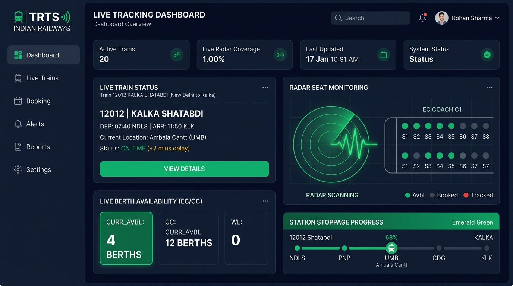
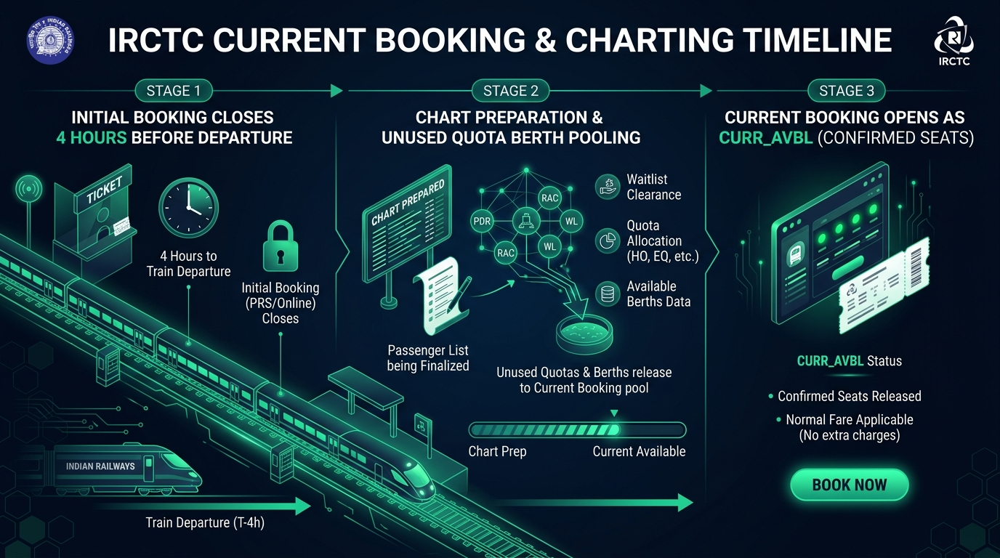
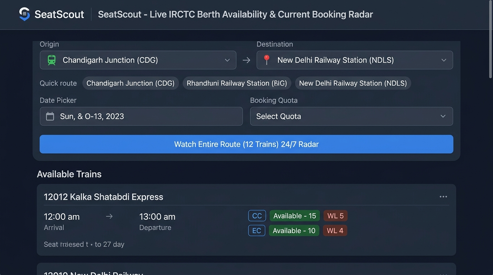
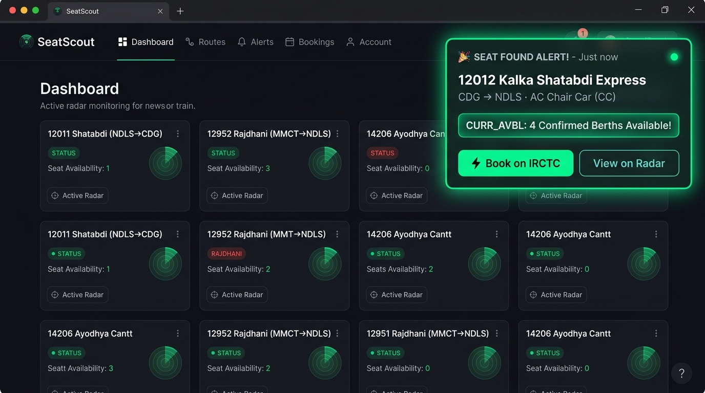
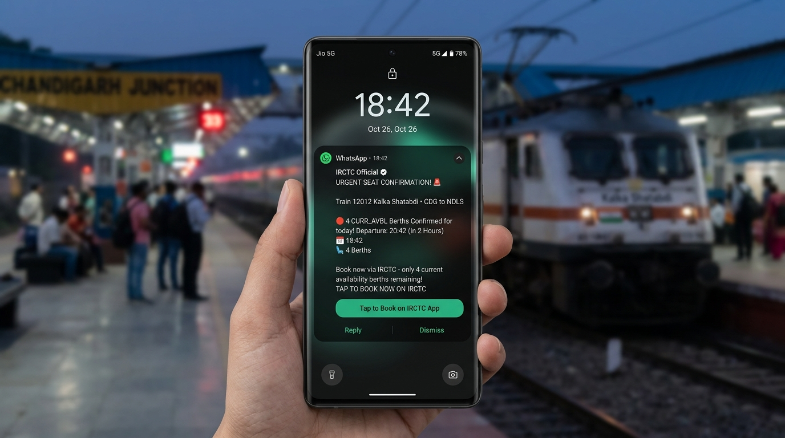
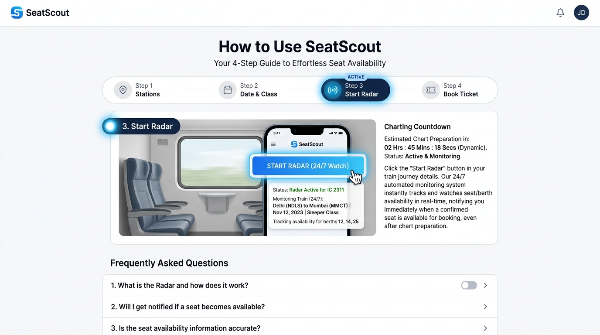

# SeatScout — Indian Railways Current Booking (`CURR_AVBL`) Radar

<p align="center">
  
</p>

<p align="center">
  <strong>An automated, real-time 24/7 PRS berth radar and last-minute confirmed seat monitoring system for Indian Railways passengers.</strong>
</p>

<p align="center">
  <a href="#-about-this-project"></a>
  <a href="#-application-flow--visual-walkthrough-with-screenshots"></a>
  <a href="#-top-right-screen-alerts--desktop-notifications"></a>
  <a href="#-meta-whatsapp-cloud-api-integration"></a>
  <a href="#-tech-stack"></a>
  <a href="LICENSE"></a>
</p>

---

## 📌 About This Project

Every single day, millions of travelers across India encounter **Waitlisted (WL)**, **RAC**, or **Regret** status when booking train tickets. When regular quota seats are exhausted, travelers often attempt emergency **Tatkal** bookings at 10:00 AM / 11:00 AM, only to face server queues, payment timeouts, and non-refundable ticket losses.

**However, there is an official, legitimate Indian Railways mechanism that most passengers miss entirely:** **Current Booking (`CURR_AVBL`)**.

### The Opportunity: What is `CURR_AVBL`?
- **4 Hours Before Departure**: Indian Railways Passenger Reservation System (PRS) freezes waitlists and prepares the **First Reservation Chart** (or at 8:00 PM the previous evening for morning departures).
- **Pooled Berths**: Unbooked berths reserved for VIPs, Senior Citizens, Defence personnel, Foreign Tourists, Railway Officials, and Emergency Concessions are unlocked and pooled into the general public pool.
- **Normal Base Fares**: These berths are sold at **standard base fare** (often with a 10% discount) with **100% confirmed coaches and berth assignments**!
- **The Challenge**: These vacant berths disappear within seconds. Travelers cannot sit and manually refresh the IRCTC website every 15 seconds.

### The Solution: SeatScout
**SeatScout is an automated, real-time background radar that eliminates manual refreshing entirely**:
1. You select a specific train or an entire travel corridor (e.g., *Chandigarh → New Delhi*).
2. SeatScout launches an independent **24/7 server-side monitoring daemon** that continuously queries PRS seat pools with adaptive frequency scaling.
3. The instant berths release, SeatScout triggers:
   - An **auditory chime** synthesized in real-time via the Web Audio API.
   - A **radiant top-right screen pop-up card** on your display with train details, berth count, and booking links.
   - An **OS-level desktop notification** that stays pinned on your screen even if you are working on other browser tabs or desktop applications.
   - A **flashing browser tab badge** (`🚨 SEATS FOUND! 12012 Shatabdi` ↔ `SeatScout`).
   - Official **Meta WhatsApp Cloud API** messages and SMS OTP/berth alerts directly to your mobile phone.
4. A direct **1-click deep link launches the official IRCTC portal** pre-filled with your journey details so you can secure your ticket before anyone else.

---

## 📖 Table of Contents
1. [About This Project](#-about-this-project)
2. [The 4-Hour Charting & Seat Release Timeline](#-the-4-hour-charting--seat-release-timeline)
3. [Application Flow & Visual Walkthrough (With Screenshots)](#-application-flow--visual-walkthrough-with-screenshots)
   - [Step 1: Search Trains & Check Live Availability](#step-1-search-trains--check-live-availability)
   - [Step 2: Activate 24/7 Radar Monitoring](#step-2-activate-247-radar-monitoring)
   - [Step 3: Radiant Top-Right Pop-up & Desktop Alert](#step-3-radiant-top-right-screen-alerts--desktop-notifications)
   - [Step 4: Meta WhatsApp Cloud API & SMS Delivery](#step-4-meta-whatsapp--mobile-sms-alerts)
   - [Step 5: Interactive 4-Step In-App Guide](#step-5-interactive-4-step-guide)
4. [System Architecture](#-system-architecture)
5. [Tech Stack](#-tech-stack)
6. [Getting Started (Local Development)](#-getting-started-local-development)
7. [Environment Configuration (.env Guide)](#-environment-configuration-env-guide)
8. [Automated CI/CD & EC2 Deployment](#-automated-cicd--ec2-deployment)
9. [API Reference](#-api-reference)
10. [Frequently Asked Questions (FAQ)](#-frequently-asked-questions-faq)

---

## ⏱️ The 4-Hour Charting & Seat Release Timeline

<p align="center">
  
</p>

| Stage | Timing | Indian Railways Action | SeatScout Radar Action |
|---|---|---|---|
| **Stage 1: Pre-Charting** | Days before up to 4 hrs before departure | Regular waitlist & Tatkal bookings open; high-demand trains show WL or Regret. | Register a single train or entire corridor on the SeatScout 24/7 Radar. |
| **Stage 2: Chart Preparation** | Exactly 4 hrs before departure (or 8:00 PM previous night for morning departures) | PRS finalizes the 1st reservation chart. Leftover quotas (VIP, Defence, Senior Citizen, Emergency) are pooled. | Radar escalates to high-frequency polling (every 10s–15s) as charting nears. |
| **Stage 3: Current Booking Open** | Chart prep until 30 min before departure | Vacant berths release as `CURR_AVBL` at standard fare with confirmed coach and berth numbers. | **Instant Multi-Channel Alert**: Top-right screen pop-up, audio chime, desktop notification, WhatsApp & SMS alert! |

---

## 📸 Application Flow & Visual Walkthrough (With Screenshots)

Follow the exact flow of the application from station search to instant confirmed booking:

---

### Step 1: Search Trains & Check Live Availability
<p align="center">
  
</p>

- **Station Autocomplete across 9,000+ Stations**: Type any station name or IRCTC code (e.g., `CDG` for *Chandigarh Junction*, `NDLS` for *New Delhi*).
- **Popular Corridor Quick-Buttons**: Instant 1-tap presets for busy routes like *Chandigarh → New Delhi*, *Mumbai CSMT → Pune*, *New Delhi → Lucknow*.
- **Journey Calendar & Quotas**: Full date picker with quota selector (`General (GN)`, `Tatkal (TQ)`, `Senior Citizen (SS)`, `Ladies (LD)`, or `Divyangjan (HP)`).
- **Live Timetable & Availability Badges**: Real-time departure/arrival times, travel duration, and class tags (`CC`, `EC`, `3A`, `2A`, `1A`, `SL`).
- **Watch Entire Route Button**: With a single click, launch a corridor-wide radar that monitors **all trains** running on the route on your travel date.

---

### Step 2: Activate 24/7 Radar Monitoring
<p align="center">
  
</p>

- **Server-Side Daemon**: The radar runs in the background on the server (`data/radars.json`). You can safely close your browser or turn off your computer — monitoring continues 24/7.
- **Adaptive Polling Intervals**:
  - `> 72 hours`: Relaxed polling.
  - `24 – 72 hours`: Normal polling.
  - `6 – 24 hours`: Urgent polling.
  - `< 6 hours` (Charting Window): **Critical high-speed polling** every 10–15 seconds to catch seats the second they release.
- **Circuit Breaker & Exponential Backoff**: Resilient gateway protection with automatic retry backoff during upstream PRS maintenance.
- **Radar Controls**: Pause, Resume, Stop, and Force-Scan actions on any active radar job.

---

### Step 3: Radiant Top-Right Screen Alerts & Desktop Notifications
<p align="center">
  
</p>

When seats unlock, SeatScout triggers a **multi-layered notification cascade**:

1. **Top-Right Screen Pop-Up (`InAppNotificationToast.tsx`)**:
   - Fixed at `top-4 right-4 z-[99999]`, floating above all modals, dialogs, and screens.
   - Radiant high-contrast card with an animated glowing green border and pulsing beacon.
   - Shows the train name, route corridor, class, and confirmed berth count (e.g. `CURR_AVBL: 4 Confirmed Berths Available!`).
   - One-click **"⚡ Book on IRCTC"** button to open the booking page immediately.
   - **"🎯 View Radar"** button to jump directly to the radar dashboard and highlight the train.
   - **"🔊 Replay Sound"** button to re-trigger the bell chime.
   - Hover-aware progress bar: stays visible for 20 seconds and **automatically pauses whenever you hover your mouse over it**.

2. **OS Desktop System Notifications (`sendDesktopNotification`)**:
   - Dispatches system notifications via `ServiceWorkerRegistration.showNotification()` with `requireInteraction: true`.
   - **Stays pinned on your screen** in the top-right corner of your desktop/laptop display even when you are reading emails, working in another browser tab, or using another application.

3. **Flashing Browser Tab Indicator (`startTabAlertBadge`)**:
   - The browser tab title visibly alternates (`🚨 SEATS FOUND! 12012 Shatabdi` ↔ `⚡ SeatScout`), ensuring the tab stands out instantly among dozens of open tabs.

4. **Test Pop-up Alert**:
   - Click the **"Test Pop-up Alert"** button on the Radar Dashboard at any time to verify the top-right card, sound chime, and desktop notification.

---

### Step 4: Meta WhatsApp & Mobile SMS Alerts
<p align="center">
  
</p>

- **Meta WhatsApp Business Cloud API**: Delivers direct WhatsApp messages using approved non-promotional utility templates:
  ```text
  Your verification code is: *482019*. Valid for 5 minutes. Do not share this code with anyone.
  ```
- **Instant Mobile Alert Message**: The moment berths appear, you receive a direct WhatsApp ping with train number, journey date, travel class, and available seat count.
- **SMS Gateway Integration**: Built-in support for **Fast2SMS** (India DLT/OTP route) and **Twilio** for global SMS delivery.
- **Resilient Fallbacks**: If WhatsApp tokens are misconfigured or expire, SeatScout provides an on-screen OTP fallback with an auto-fill button and direct `wa.me` click-to-chat links.

---

### Step 5: Interactive 4-Step Guide
<p align="center">
  
</p>

- Accessible directly from the top navigation bar.
- Guides first-time travelers through:
  - **1. Stations**: How to choose origin and destination with station autocomplete.
  - **2. Date & Class**: Picking journey dates around charting hours and choosing coach tiers.
  - **3. Start Radar**: Turning on 24/7 background tracking on trains or entire routes.
  - **4. Book Ticket**: Booking confirmed berths the second they release.
- Includes clear, jargon-free explanations for common questions.

---

## 🏗️ System Architecture

```
+-----------------------------------------------------------------------------------+
|                                  USER BROWSER / CLIENT                             |
|  - React 19 Frontend (Vite)                                                       |
|  - In-App Top-Right Toast Card (InAppNotificationToast.tsx) [z-index: 99999]      |
|  - Web Audio API Sound Synthesizer (Pure Sine Chime Melodies)                     |
|  - Service Worker (public/sw.js) for Web Push & Desktop Notifications             |
|  - Flashing Tab Title Alert Badge (startTabAlertBadge)                            |
+------------------------------------------+----------------------------------------+
                                           |
                                 REST API & Web Push
                                           |
+------------------------------------------v----------------------------------------+
|                               EXPRESS BACKEND SERVER                              |
|  - server.ts: HTTP Server & Vite Middleware                                       |
|  - radarRouter.ts: Radar Management & VAPID Endpoints                             |
|  - radarScheduler.ts: 24/7 Background Seat Worker (Adaptive Polling)              |
|  - radarStore.ts: Persistent JSON Storage (radars.json & subscriptions)           |
|  - pushService.ts: Web Push Engine with Self-Healing VAPID Keys                   |
|  - metaWhatsappService.ts: Meta Cloud API Integration                             |
|  - smsGatewayService.ts: Fast2SMS & Twilio SMS Dispatch                           |
|  - emailNotificationService.ts: Nodemailer SMTP Dossiers                          |
|  - realIrctcService.ts: PRS Upstream Gateway with Circuit Breakers                 |
+------------------------------------------+----------------------------------------+
                                           |
                    External APIs / Notification Gateways
                                           |
       +--------------------+--------------+---------------+--------------------+
       |                    |                              |                    |
+------v-----+       +------v------+                +------v------+      +------v-----+
|  Meta WA   |       |   Fast2SMS  |                |  Web Push   |      | Google AI  |
|  Cloud API |       |  & Twilio   |                |  Endpoints  |      |   Gemini   |
+------------+       +-------------+                +-------------+      +------------+
```

---

## 🛠️ Tech Stack

- **Frontend**:
  - **React 19** (Functional components, hooks, error boundaries)
  - **Tailwind CSS v4** (Modern utility-first styling with `@import "tailwindcss";`)
  - **Lucide React** (Clean, consistent iconography)
  - **Web Audio API** (Four-note melodic sine chime synthesizer: C5 → E5 → G5 → C6)
  - **Canvas Confetti & Motion** (Celebration animations on seat discovery)
- **Backend**:
  - **Node.js & Express** (Modular REST API routing)
  - **`tsx`** (Modern TypeScript execution engine)
  - **`web-push`** (W3C standard push protocol with Base64URL VAPID validation)
  - **`nodemailer`** (SMTP email delivery for detailed berth dossiers)
  - **`esbuild`** (High-speed production server bundling into `dist/server.cjs`)
- **AI & Data Intelligence**:
  - **Google Gemini API (`@google/genai`)**: Predicts charting times, analyzes confirmation chances, and recommends Tatkal vs. Current Booking strategies.
- **Data Feeds & Gateways**:
  - Live Indian Railways PRS & CRIS timetable data
  - Meta WhatsApp Business Graph API v20.0
  - Fast2SMS & Twilio SMS gateways

---

## ⚡ Getting Started (Local Development)

### 1. Clone the Repository
```bash
git clone https://github.com/Nitish-24/SeatScout.git
cd SeatScout
```

### 2. Install Dependencies
```bash
npm install
```

### 3. Create Environment Configuration
Copy the example environment template:
```bash
cp .env.example .env
```
Open `.env` and fill in your keys (see configuration guide below).

### 4. Run Development Server
```bash
npm run dev
```

Open **`http://localhost:3000`** in your browser.

---

## ⚙️ Environment Configuration (.env Guide)

```env
# 1. Google Gemini API Key (For AI Charting & Strategy Advice)
GEMINI_API_KEY="your_gemini_api_key_here"

# 2. Application Base URL
APP_URL="http://localhost:3000"

# 3. Meta WhatsApp Cloud API (For real WhatsApp notifications)
# Obtain from https://developers.facebook.com/apps > WhatsApp > API Setup
META_WHATSAPP_TOKEN="EAA..."
META_PHONE_NUMBER_ID="105928372619283"
WHATSAPP_TEMPLATE_NAME="otp_verification"
WHATSAPP_TEMPLATE_LANG="en_US"

# 4. SMS Gateway: Fast2SMS (India DLT/OTP Route)
FAST2SMS_API_KEY="f2s_..."

# 5. SMS Gateway: Twilio (Optional Global Route)
TWILIO_ACCOUNT_SID=
TWILIO_AUTH_TOKEN=
TWILIO_PHONE_NUMBER=

# 6. Long-form Email Alerts (SMTP via Nodemailer)
SMTP_HOST=smtp.gmail.com
SMTP_PORT=587
SMTP_USER=your_email@gmail.com
SMTP_PASS=your_app_password
ALERT_FROM_EMAIL=alerts@seatscout.in
```

*(Note: All notification services degrade gracefully. If optional credentials are not provided, SeatScout displays rich in-app UI notifications without crashing).*

---

## 🚀 Automated CI/CD & EC2 Deployment

SeatScout includes a preconfigured **GitHub Actions CI/CD pipeline** in `.github/workflows/main.yml`.

### Deployment Pipeline Workflow
Whenever changes are pushed to the `main` branch, GitHub Actions executes:
1. **SSH Authentication**: Connects securely to your AWS EC2 host using repository secrets (`EC2_SSH_KEY`, `EC2_HOST`, `EC2_USER`).
2. **Automated Deploy Script**: Executes `~/deploy.sh` on the remote instance.
3. **Zero-Downtime Reload**: Installs dependencies, runs `npm run build`, and restarts the server process with PM2.

```yaml
name: Deploy SeatScout
on:
  push:
    branches: [ main ]
jobs:
  deploy:
    runs-on: ubuntu-latest
    steps:
      - name: Configure SSH
        run: |
          mkdir -p ~/.ssh
          echo "${{ secrets.EC2_SSH_KEY }}" > ~/.ssh/ec2_key
          chmod 600 ~/.ssh/ec2_key
          ssh-keyscan -H "${{ secrets.EC2_HOST }}" >> ~/.ssh/known_hosts
      - name: Deploy to EC2
        run: ssh -i ~/.ssh/ec2_key "${{ secrets.EC2_USER }}@${{ secrets.EC2_HOST }}" "~/deploy.sh"
```

### Manual Production Build
```bash
# Build Vite client & bundle Express server with esbuild
npm run build

# Start production server on port 3000
npm start
```

---

## 📡 API Reference

### Radar Endpoints
| Method | Endpoint | Description |
|---|---|---|
| `GET` | `/api/radar/list?clientId=...` | List all active and completed radars for a client device. |
| `POST` | `/api/radar/create` | Create a new Single Train or Route Corridor radar job. |
| `POST` | `/api/radar/:id/pause` | Pause an active background radar. |
| `POST` | `/api/radar/:id/resume` | Resume a paused radar. |
| `POST` | `/api/radar/:id/stop` | Stop monitoring and mark radar as cancelled. |
| `DELETE` | `/api/radar/:id` | Delete radar job and remove from history. |
| `POST` | `/api/radar/:id/scan` | Force an immediate PRS availability check for a radar. |
| `GET` | `/api/radar/vapid-public-key` | Return valid 65-byte Base64URL VAPID public key. |
| `POST` | `/api/radar/push/subscribe` | Register browser push subscription for a client device. |
| `POST` | `/api/radar/push/test` | Trigger a test web push notification to client device. |

### Train & Timetable Endpoints
| Method | Endpoint | Description |
|---|---|---|
| `GET` | `/api/trains/search` | Search trains between two IRCTC station codes. |
| `GET` | `/api/trains/availability` | Fetch live berth availability across classes and dates. |
| `GET` | `/api/trains/livestatus` | Real-time train delay, platform number, and live running status. |
| `POST` | `/api/ai/predict-charting` | Gemini AI charting time and Current Booking berth prediction. |

### Phone & Notification Endpoints
| Method | Endpoint | Description |
|---|---|---|
| `POST` | `/api/notifications/phone/request-otp` | Send verification OTP via WhatsApp or SMS. |
| `POST` | `/api/notifications/phone/verify-otp` | Verify OTP code and register phone number. |
| `POST` | `/api/notifications/phone/send-alert` | Dispatch manual or automated seat alert to phone. |

---

## ❓ Frequently Asked Questions (FAQ)

#### Q: What is `CURR_AVBL`?
**A:** `CURR_AVBL` stands for **Current Booking Available**. When Indian Railways prepares the final reservation chart (~4 hours before departure or 8:00 PM the night before), all unbooked quota seats (VIP, Defence, Senior Citizen, Emergency) are pooled and released to the general public at standard base fares with confirmed coach and berth assignments.

#### Q: Do I need to keep the browser tab open?
**A:** No! The background radar runs 24/7 on the server. Even if your browser is closed, your phone is locked, or your computer is asleep, the server continues scanning PRS seat pools and dispatches WhatsApp, SMS, and Push notifications the second seats appear.

#### Q: How do top-right screen pop-up alerts work when I am on another tab or app?
**A:** When seats unlock, SeatScout triggers an OS-level Web Notification configured with `requireInteraction: true`. This causes the notification to pop up in the top-right corner of your screen (or Action Center) and stay there until you click or dismiss it. In addition, the SeatScout tab title flashes in your browser tab bar.

#### Q: Can I monitor multiple trains on a route at once?
**A:** Yes! Tap **"Watch Entire Route"** on any search result to monitor every single train running on that corridor on your travel date.

#### Q: Is booking done through IRCTC?
**A:** Yes. SeatScout never asks for your IRCTC passwords or financial credentials. The alert pop-up provides a direct 1-click deep link to the official IRCTC portal pre-filled with your journey details so you can complete payment safely.

---

## 📄 License

This project is licensed under the [MIT License](LICENSE).
